# Лабораторная работа № 2: Командная строка Windows.
#### Вариант 8.
## Цель работы: Развитие профессиональных навыков работы в командной строке Windows.
### Задачи работы:
```shell
– Создание структуры каталогов;
– Создание, просмотр, редактирование, удаление файлов;
– Удаление структуры каталогов;
– Манипулирование операционной системой Windows с
помощью командной строки.
```
## Задание на лабораторную работу:
```shell
Загрузить командную строку (Пуск – Программы – Стандартные – Командная строка).
    1) В каталоге Temp создать дерево каталогов по вариантам как показано в вариантах заданий с использованием команд табл. 1.
    2) В каталоге А2 создать подкаталоги В4 и В5 и удалить каталог В2.
    3) В каталоге Personal создать файл Name.txt, содержащий информацию о фамилии, имени и отчестве студента. Здесь же создать файл Date.txt, содержащий информацию о дате рождения студента. В этом же каталоге создать файл School.txt, содержащий информацию о школе, которую закончил студент.
    4) В каталоге University создать файл Name.txt, содержащий информацию о названии вуза и специальность, на которой студент обучается. Здесь же создать файл Mark.txt с оценками на вступительных экзаменах и общей суммой баллов.
    5) В каталоге Hobby создать файл hobby.txt с информацией об увлечениях студента.
    6) Скопировать файл hobby.txt в каталог А2 и переименовать его в файл Lab_№варианта.txt.
    7) Сделать копию файла Lab_№варианта.txt (например, copy_Lab_№варианта.txt ) в этом же каталоге и удалить его.
    8) Очистить экран от служебных записей.
    9) Вывести на экран поочередно информацию, хранящуюся во всех файлах каталога Personal.
    10) Отсортировать все файлы, хранящиеся в каталоге Personal, по имени.
    11) Объединить все файлы, хранящиеся в каталоге Personal, в файл all.txt и вывести его содержимое на экран.
    12) Отредактировать файл all.txt, добавив в него год вашего рождения, и вывести его содержимое на экран.
    13) Скопировать файл all.txt в директорию А1.
    14) Удалить все директории, в названии которых есть буква A или цифра 2.
    15) Изменить строку приглашения в соответствии с номером варианта.
```
### Необходимые команды.
Название команды | Синтаксис команды
-- | - 
Создание файла с консоли | copy con <имя файла>
Удаление файла | del <имя файла>
Переименование файла | ren <имя файла 1> <имя файла 2>
Редактирование файла | edit <имя файла>
Переход на диск | <имя диска>
Переход в каталог | cd <путь>
Сортировка по имени файлов каталога | Ds
Сортировка по расширению файлов каталога | Ne
Создание каталога | md <имя каталога>
Удаление каталога | rd <имя каталога>
Очистка окна | Cls
Вывод содержимого файла на экран | type <имя файла>
Копирование файла | copy <путь 1 (что копируется)> <путь 2 (куда копируется)>
Поиск файла | filefind <имя файла>
Работа с командной строкой | Prompt
Информация о команде | <команда> /?
#
## Контрольные вопросы:
```shell
1. Что такое командная строка?
2. Перечислите основные команды управления файлами в командной строке;
3. Перечислите команды вывода основной информации системы;
4. Перечислите команды ввода/вывода файлов.
5. Возможно ли полноценное управление системой, пользуясь только командной строкой? Ответ обоснуйте.
6. Подумайте, чем отличается командная строка Windows от командной строки MS-DOS, несмотря на их схожесть в командах.
7. Приведите примеры интерпретаторов команд в других операционных системах.
```

## Выполнение лабораторной работы:
### 1. Каталог Temp:
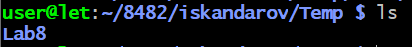
### 2. Создание подкатологов В4 и В5 в каталоге А2 и удаление каталога В2:
##### (каталог B2 отсутствует в A2 в этом варианте, поэтому невозможно удалить)
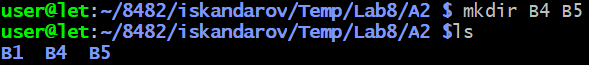
### 3. Каталог Personal:
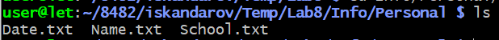
### 4. Каталог University:
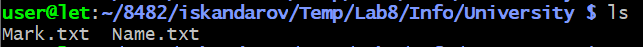
### 5. Каталог Hobby:
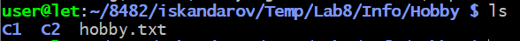
### 6. Копирование файла hobby.txt в каталог A2 и переименовывание его в Lab_№8:
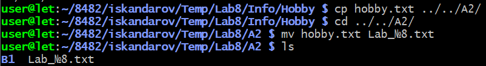
### 7. Копия Lab_№8 и удаление её:
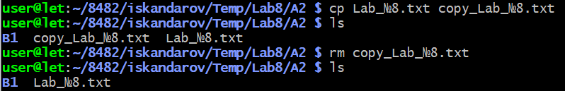
### 8. ..?
### 9. Вывод поочерёдной информации, хранящуюся во всех файлах каталога Personal:
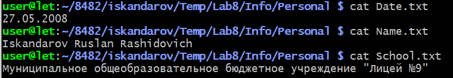
### 10. Сортировка всех файлов в этом каталоге по имени:
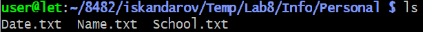
### 11. Объединение всех файлов в этом каталоге в один, с названием all.txt:
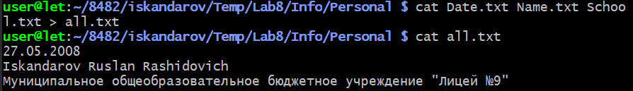
### 12. Редактирование файла all.txt, добавлением года рождения и вывод на экран:
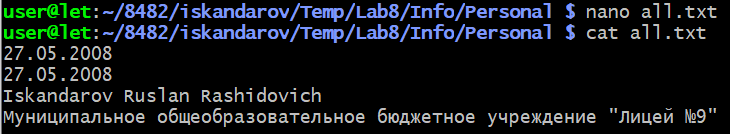
### 13. Копирование файла all.txt в директорию А1:
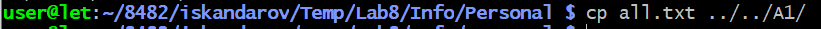
### 14. ..?
### 15. Изменение строки приглашения в соответствии с номером варианта:
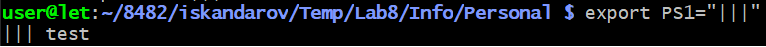

## Ответы на контрольные вопросы:
### 1. Командная строка - это важный компонент операционной системы, позволяющий осуществлять управление всей ОС.
### 2. Для создания файла применяется команда touch. Для удаления файлов применяется команда rm. Для копирования: cp, а для перемещения файла: mv. 
### 3. Используются uname -a в Linux, и msinfo32 или systeminfo в Windows.
### 4. Используются echo и cat.
### 5. Да, возможно. Так как через командную строку можно управлять файлами и администрировать ОС.
### 6. Командная строка Windows(CMD) - консольное приложение Windows, которая позволяет управлять ОС, а MS DOS - однозадачная операционная система.
### 7. bash в Linux, zsh в macOS, command.com в DOS и PowerShell в Windows.