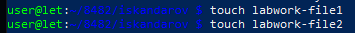

# Лабораторная работа №24
## ИЗУЧЕНИЕ ФАЙЛОВОЙ СИСТЕМЫ ОС LINUX И ФУНКЦИЙ ПО ОБРАБОТКЕ И УПРАВЛЕНИЮ ДАННЫМИ
### Цель работы: 
```shell
• Изучение команд, связанных с пользователями и группами;
• Изучение   структуры   файловой   системы   Linux,   изучение   общих  команд   создания,   удаления,   модификации   файлов   и   каталогов,   функций  манипулирования данными, алиасами;
• Изучение иерархии процессов;
• Приобретение   навыков   по   смене   атрибутов   объектов,   смене   прав  доступа к объектам;
• Изучение   организации   безопасности   системы,   местонахождение  файлов с паролями, просмотр системной информации и получение служебной информации.
```
### План проведения занятия:
```shell
1.	Ознакомиться с краткими теоретическими сведениями. Приобрести навыки работы в терминале Linux.
2.	Научиться создавать новые файлы и каталоги, разобрать назначение прав доступа к файлам и папкам.
3.	Приготовиться к сдаче лабораторной работы.
```
### Оборудование: 
#### Аппаратная часть: персональный компьютер, сетевой или локальный принтер. 
#### Программная часть: операционная система Linux Ubuntu.
### Краткие теоретические сведения:
### Файловая структура системы LINUX: В операционной системе LINUX файлами считаются обычные файлы, каталоги, а также специальные файлы, соответствующие периферийным устройствам (каждое устройство представляется в виде файла). Доступ ко всем файлам однотипный, в том числе, и к файлам периферийных устройств. Такой подход обеспечивает независимость программы пользователя от особенностей ввода/вывода на конкретное внешнее устройство.
### Порядок выполнения работы
```shell
1.	Ознакомиться с файловой структурой ОС LINUX. Изучить команды работы с файлами. 
2.	Используя команды ОС LINUX, создать два текстовых файла.
3.	Полученные файлы объединить в один файл и его содержимое просмотреть на экране.
4.	Создать новую директорию и переместить в нее полученные файлы.
5.	Вывести полную информацию обо всех файлах и проанализировать уровни доступа.
6.	Добавить для всех трех файлов право выполнения членам группы и остальным пользователям.
7.	Просмотреть атрибуты файлов.
8.	Получить информацию об активных процессах и имена других пользователей.
```
### Контрольные вопросы
```shell
1. Что считается файлами в OC LINUX?
2. Объясните назначение связей с файлами и способы их создания.
3. Что определяет атрибуты файлов и каким образом их можно просмотреть и изменить?
4. Какие методы создания и удаления файлов, каталогов Вы знаете?
5. В чем заключается поиск по шаблону?
6. Какой командой можно получить список работающих пользователей и сохранить его в файле?
```

## Решение заданий:
### 2. Создание двух текстовых файлов:
