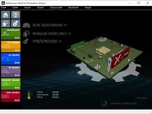

# Практическая работа №8.
## Тестирование персонального компьютера с помощью утилиты Passmark Perfomance Test.

#### Цель: Провести финальное тестирование стабильности системы для последующей разработки технического задания по внедрению компьютерной системы.

## Теоретические сведения:
### PerformanceTest - набор тестов, позволяющих оценить общую производительность вашего ПК по сравнению с другими компьютерами. В программу входят двадцать семь стандартных тестов в семи группах, плюс еще пять для пользовательских тестов.
### Среди стандартных можно отметить тесты процессоров, 2D и 3D графики, дисковых накопителей, памяти, CD/DVD-приводов и многих других составляющих компьютера.

# 

## В задачу утилиты входит:
```shell
• Выяснение того, работает ли ваш ПК на том уровне, на котором он должен работать;
• Сравнение производительности вашего компьютера с производительностью машин подобной и/или более крутой конфигурации;
• Объективные, независимые измерения помогут вам сделать правильное решение при покупке;
• Использование самых последних испытаний для создания ваших собственных сценариев эталонного тестирования
```
## Стандартные наборы тестов:
```shell
• Тестирование ЦП Математические операции: сжатие, шифрование, MMX/SSE, инструкции 3DNow! и др.;
• Тестирование 2D-графики: черчение/рисование, битовые карты/битовые матрицы/побитовое отображение, шрифты, текст и элементы графического пользовательского интерфейса;
• Тестирование 3D-графики: трехмерная графика уровня DirectX 8.1, DirectX 9 и анимация;
• Тестирование диска: чтение, запись и поиск файлов на диске;
• Тестирование памяти: ассигнование и доступ к скорости памяти и оценка эффективности;
• Тестирование CD и DVD: проверка скорости CD/DVD драйверов.
• Усовершенствованные настраиваемые тестирования (доступны только в зарегистрированной версии):
• Усовершенствованный тест для диска;
• Усовершенствованные тесты для CD/DVD;
• Усовершенствованный тест 3D -графики;
• Усовершенствованный тест организации работы в сети (для Ethernet, интернета и беспроводной связи);
• Усовершенствованный тест для памяти;
• Усовершенствованный тест мультипрограммной работы.
```

## Порядок выполнения работы:

### 1.	В программе Perfomance Test есть 6 видов тестов:
```shell 
Passmark, CPUmark, 2Dmark, 3Dmark, Memory Mark, Disk mark. 
```
Каждый вид теста разделяется на подвид. Допустим CPUMark включает в себя еще 9 подвидов тестов, 2DMark 7 подвидов  и так далее.
### 2.	Вам необходимо провести все подвиды каждого из теста и заполнить результаты в виде таблички.

Название теста | Результат | World average | World Maximum
 -- |- | - | -
 -- |  |  |
 -- |  |  |
 -- |  |  |
			

### 3.	Сделайте сравнение представленных в следующей табличке тестов с тестами проведенными в программе Aida64Extreme

Название теста | Aida64 | Perfomance Test 
-- | - | -
Чтение из памяти / Memory read uncached	| - | -	
Задержка памяти / Memory Latency | - | 
CPU AES / Encryption | - |		
Integer Math / CPU PhotoWorxx | - |

### 4. Проверьте температуру процессора и запишите ее.
### 5. Проведите сразу полный тест CPUmark.
### 6. Проверьте температуру процессора после теста и запишите ее.
### 7. Сделайте вывод по проделанной работе, а именно дайте окончательную, субъективную оценку, существующей компьютерной системы, опираясь на результаты всех проделанных тестов, как в текущей практической работе, так и в предыдущих работах. Результат оценки выполните для каждого устройства.

Устройство | Оценка (от 1 до 10)
-- | -
Жесткий диск  | -
Процессор  | -
ОЗУ | -
Видеоадаптер | -	
Температурные показатели системы | -	
Общая оценка системы (исходя из верхних показателей) | -	

## Вопросы:
```shell
1. Как вы считаете для каких целей может быть использована тестируемая Вами компьютерная система?
2. На ваш взгляд, какие бы параметры компьютерной системы можно было бы улучшить? Укажите пример.
3. Предложите свой вариант компьютерной системы для образовательного процесса в кабинете 403. Напишите полные характеристики с указанием стоимости каждого устройства.
```

## Выполнение заданий: 

### 3. Все подвиды каждого из теста в PerfomanceTest:
Название теста | Результат | World average | World Maximum
-- | - | - | -
CPU Mark | 4097 | 6162 | 38528
--- | | |
Integer Math | 7151 | 11216 | 250735
Prime Numbers | 11 | 19 | 361
Compression | 5260 | 8622 | 160509
Physics | 245 | 373 | 357361
CPU Single Threaded | 1732 | 1578 | 3205
Floating Point Math | 3003 | 5359 | 90808
Extended Instructions (SSE) | 82 | 81 | 4546
Encryption | 509 | 1223 | 23077
Sorting | 3229 | 5144 | 87852
--- | | |
3D Graphics Mark | 157 | 2969 | 24533
--- | | |
DirectX 9 | 8 | 68 | 304
DirectX 10 | 1 | 48 | 1087
--- | | |
Disk Mark | 3043 | 2334 | 59829
--- | | |
Disk Sequential Read | 456 | 285 | 7813
Disk Random Seek + RW | 124 | 138 | 7009
Disk Sequential Write | 260 | 221 | 6574
--- | | |
2D Graphics Mark | 410 | 588 | 1823
--- | | |
Simple Vectors | 20 | 23 | 131
Fonts and Text | 157 | 190 | 898
Image Filters | 629 | 676 | 1967
Direct 2D | 11 | 21 | 113
Complex Vectors | 53 | 113 | 405
Windows Interface | 44 | 94 | 2228
Image Rendering | 716 | 631 | 2489
--- | | |
Memory Mark | 1240 | 1653 | 4453
--- | | |
Database Operations | 64 | 60 | 163
Memory Read Uncached | 11347 | 9585 | 26954
Available RAM | 952 | 8637 | 1974080
Memory Threaded | 17518 | 16477 | 125442
Memory Read Cached | 19557 | 18563 | 40015
Memory Write | 7384 | 6473 | 21969
Memory Latency | 27 | 42 | 483
--- | | |
Overall PassMark Rating | 1100 | 2455 | 10793


### 3. Сравнение представленных в следующей табличке тестов с тестами проведенными в программах PerfomanceTest и Aida64 Extreme:

Название теста | Aida64 | Perfomance Test 
-- | - | -
Чтение из памяти / Memory read uncached	| 11437 MB/s | 11347 MB/s
Задержка памяти / Memory Latency | 75.8 ns | 27 ns
CPU AES / Encryption | 11353 MB/s |	509 MB/s	
Integer Math / CPU PhotoWorxx | - | 7151 MOps/s

## 4. 35ºC.
## 6. 41ºC.
## 7. Таблица:
Устройство | Оценка (от 1 до 10)
-- | -
Жесткий диск | 7
Процессор  | 6
ОЗУ | 5
Видеоадаптер | 4	
Температурные показатели системы | 8	
Общая оценка системы (исходя из верхних показателей) | 6.

## Ответы на вопросы:
### 1. Компьютер пригоден для выполнений простых работ и задач, не нагружающие систему.
### 2. Я бы предпочёл улучшить видеоадаптер, в пример приведу 3D Mark тест, в котором был очень маленький показатель FPS.
### 3. Таблица:

Устройство | Вариант | Цена
- | - | -
Процессор | Intel Core i5-12400F OEM | 13,2k Rub
Оперативная память(ОЗУ) | Apacer [EL.08G21.GSH] 8 ГБ DDR5 | 7k Rub
Накопитель | Apacer AS350 PANTHER 512 ГБ SSD | 7,6k Rub
Монитор | ASUS VA24EHF | 6,6k Rub
Клавиатура | Logitech K120 | ~1,8k – 2,5k Rub
Компьютерная мышь | Logitech B100 или SteelSeries Prime | ~800 Rub. (B100) или ~4k Rub. (Prime).
Видеоадаптер | GeForce RTX 2080 Ti | ~25k Rub

### Average price = ~63,2k Rubles